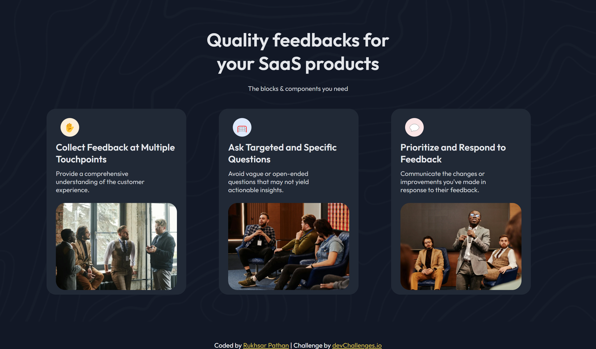

# SaaS Landing Page – DevChallenges.io

Welcome! 👋  
This is a **responsive SaaS Landing Page** project completed as part of the [DevChallenges.io](https://www.devchallenges.io/) challenges.

The project focuses on building a **modern, clean, and fully responsive** marketing section for a SaaS (Software as a Service) product.

---

## 📸 Live Preview

[Click here to view the Live Project!][https://rukhsarpathan.github.io/Saas-Landing-Page/]


> *(Insert a screenshot here later if you want!)*  
Example:  


---

## 🚀 Features

- Beautiful **three-card feature layout**
- Fully **responsive design**:
  - 3 cards side-by-side on desktop
  - 2 cards top, 1 card bottom on tablets
  - 1 column stack on mobile
- **Custom background** pattern
- **Hover effects** on cards for interactive feel
- **Custom icons (emoji placeholders)** with colorful backgrounds
- **Google Font (Outfit)** integration
- Clean and minimalistic visual style

---

## 🛠️ Built With

- **HTML5**
- **CSS3**
- **Flexbox** & **CSS Grid**
- **Media Queries** for responsiveness
- **Google Fonts – Outfit**

---

## 📱 Responsive Breakpoints

| Device | Layout |
|:---|:---|
| Desktop (≥1024px) | 3 cards side-by-side |
| Tablet (≤1024px) | 2 cards top + 1 card bottom |
| Mobile (≤640px) | Single column stack |

---

## 📦 Installation

1. Clone the repository:

```bash
git clone https://github.com/your-username/your-repo-name.git
```

2. Open `index.html` in your browser.

✅ No frameworks, no dependencies — **pure HTML and CSS**!

---

## 📄 License

This project is open source and free to use for learning purposes.

---

## 🙋‍♀️ About Me

**Rukhsar Pathan**  
Frontend Developer & Creative Technologist ✨  
[LinkedIn](https://www.linkedin.com/in/rukhsarpathan7/)


